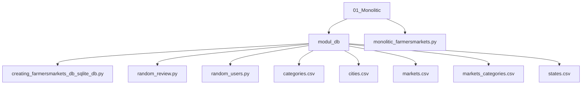

## Системные требования:  
- Python 3  

## Установка/Запуск приложения:  
###1. Скачайте содержимое папки 01_Monolitic  

###2. Запустите приложение monolitic_farmersmarkets.py.  
  > [!important]
  > При первом запуске будет сформирована база данных SQLite в папке modul_db  
  >```  
  >!!!!!!!!!!!!!!!!!!!!!!!!!!!!!!!!!!!!!!!!!!!!!!!!!!!!!!!!!!!!!!!!!!!!!!!!!!!!!
  >!                                                                           !
  >!  Файл базы данных создан: <Путь>\01_Monolitic\modul_db\farmersmarkets.db  !
  >!                                                                           !
  >!!!!!!!!!!!!!!!!!!!!!!!!!!!!!!!!!!!!!!!!!!!!!!!!!!!!!!!!!!!!!!!!!!!!!!!!!!!!!
  >```  
  Появиться меню и запрос на ввод команды:  
  ```
  Команды:
  
      D - Удалить все изменения, внесенные в базу данных.
      1 - Вход
      2 - Просмотр списка всех фермерских рынков в стране.
      3 - Поиск фермерского рынка по городу и штату.
      4 - Поиск фермерского рынка по id с возможностью ограничить зону поиска дальностью.
      5 - Подробная информация о рынке.(включая рецензии и рейтинги)
      6 - Оценить рынок, оставить отзыв
      0 - Закрыть.
  
  Введите команду =>
  ```  

## Работта с программой (команды):  
- d - Удалить все изменения, внесенные в базу данных.  
  Удаляет все изменения, обновляет случайные учетные записи, оценки и рецензии рынков. Авторизация не требуется.  
- 1 – Вход / Выход  
  Для входа программа предложит три случайно выбранных в базе данных учетных записи. Ведите запрашиваемые данные в консоль.  
Пример вывода:  
```  
Для входа воспользуйтесь одной из учетных записей:
---------------- ------
Имя пользователя Пароль
---------------- ------
shiryaev6        Xv!Yn
ermakov          xnlQh
zakharov2        j&iYw
---------------- ------
```  
- 2 - Просмотр списка всех фермерских рынков в стране.  
  Выводит все фермерские рынки постранично. Авторизация не требуется.  
```  
------- ----------------------------------------------------------- ---------------- ---- ------ ---
ID      Наименование                                                Город            Штат Индекс *
------- ----------------------------------------------------------- ---------------- ---- ------ ---
1000021 Mid-Town Farmers Market                                     Oxford           MS   38655  4.5
1000194 Riverside Farmers' Market                                   Riverside        IL   60546  2.7
1000210 Colorado Farm and Art Market                                Colorado Springs CO   80919  2.6
------- ----------------------------------------------------------- ---------------- ---- ------ ---
Страница 1/n. Нажмите Enter для продолжения или 'q'+Enter для выхода...
```  
- 3 - Поиск фермерского рынка по городу и штату. Авторизация не требуется.  
- 4 - Поиск фермерского рынка по id с возможностью ограничить зону поиска дальностью. Авторизация не требуется.  
- 5 - Подробная информация о рынке.(включая рецензии и рейтинги). Авторизация не требуется.  
- 6 - Оценить рынок, оставить отзыв.  
  Если вы не вошли в учетную запись программа предложит это сделать. Требуется авторизация.
- 0 – Закрыть.  
  Закрывает программу. Авторизация не требуется.  